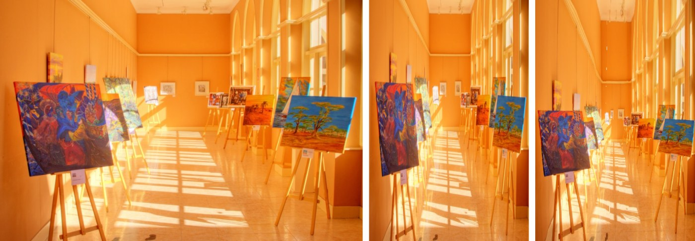

# Patch-Based Image Warping for Content-Aware Retargeting

A C++ implementation of [Patch-Based Image Warping for Content-Aware Retargeting](http://graphics.csie.ncku.edu.tw/Tony/papers/IEEE_Multimedia_resizing_2013_Feb.pdf)
(IEEE Transactions on Multimedia, 2013) with OpenCV and CPLEX.

Resizing an image to a new aspect ratio by plain scaling distorts everything
equally. This method instead distorts the **unimportant** regions (walls,
floor, sky) and keeps the **salient** objects close to their original shape.


<sub>Left to right: source (908×606), linear scaling to 400×606, this method.</sub>

## How it works

1. **Saliency** (Python, `gbvs/`): compute a saliency map of the input image
   with GBVS, Itti-Koch-Niebur or Context-Aware Saliency.
2. **Segmentation**: split the image into patches with graph-based
   segmentation, then merge tiny (< 0.01% of the image) and similarly
   colored neighboring patches.
3. **Significance**: average the saliency map over each patch.
4. **Mesh**: lay a regular grid (~20 px cells) over the image.
5. **Warping**: find new positions for the grid vertices by minimizing a
   quadratic energy with CPLEX:
   - **DST**: salient patches should only undergo a similarity transform (keep their shape);
   - **DLT**: non-salient patches should follow the global linear scaling;
   - **DOR**: horizontal / vertical grid lines should stay horizontal / vertical;
   - subject to the grid border lying on the target frame and no grid fold-overs.
6. **Rendering**: map every grid cell of the source onto its new position
   with a perspective transform.

## Requirements

Tested on Ubuntu 24.04 with g++ 13.

| Dependency | Version | Where the build expects it |
|---|---|---|
| OpenCV + opencv_contrib | 3.4.13 | `opencv_local/` in this repo |
| IBM ILOG CPLEX Optimization Studio | 22.x | `cplex_local/` in this repo |
| Python | 3.x | virtualenv at `env/` in this repo |

`opencv_local/`, `cplex_local/` and `env/` are git-ignored, so every machine
installs its own copy.

### OpenCV 3.4.13 with opencv_contrib

The `ximgproc` module from opencv_contrib is required (graph segmentation).

```bash
# from the repository root
REPO=$PWD
wget -O opencv.zip https://github.com/opencv/opencv/archive/3.4.13.zip
wget -O opencv_contrib.zip https://github.com/opencv/opencv_contrib/archive/3.4.13.zip
unzip opencv.zip && mv opencv-3.4.13 opencv
unzip opencv_contrib.zip && mv opencv_contrib-3.4.13 opencv_contrib

mkdir -p opencv/build && cd opencv/build
cmake -D CMAKE_BUILD_TYPE=Release \
      -D CMAKE_INSTALL_PREFIX=$REPO/opencv_local \
      -D OPENCV_EXTRA_MODULES_PATH=$REPO/opencv_contrib/modules \
      -D OPENCV_GENERATE_PKGCONFIG=ON \
      ..
make -j$(nproc)
make install
cd $REPO
```

Check that the install worked (OpenCV 3.x ships `opencv.pc`, not `opencv4.pc`):

```bash
PKG_CONFIG_PATH=$PWD/opencv_local/lib/pkgconfig pkg-config --modversion opencv   # 3.4.13
```

Optional: to get the result windows on screen, install `libgtk2.0-dev`
**before** running cmake. Without it the program still writes every image
to `result/`, it just skips the windows.

The `opencv/` and `opencv_contrib/` source folders can be deleted after
`make install`.

### CPLEX

1. Download CPLEX Optimization Studio from the
   [IBM Academic Initiative](https://academic.ibm.com/a2mt/downloads/data_science#/)
   (the free Community Edition is limited to small problems and is not
   enough for full-size images).
2. Run the installer and choose `<this repo>/cplex_local` as the install directory:
   ```bash
   chmod +x cplex_studio*.linux_x86_64.bin
   ./cplex_studio*.linux_x86_64.bin
   ```
3. The Makefile then finds the headers and static libraries under
   `cplex_local/cplex/` and `cplex_local/concert/`.

### Python (saliency)

```bash
python3 -m venv env
env/bin/pip install -r gbvs/requirements.txt
```

## Quick start

Put your image in `gbvs/images/` (the folder is empty in the repository;
input images are not tracked), then run the whole pipeline
(saliency → build → warp) with one command. Images larger than 1024 px are
first scaled down proportionally (`MAX_SIDE=... ./pipeline.sh` to change it):

```bash
./pipeline.sh                           # gbvs/images/gallery.jpg, GBVS, square output
./pipeline.sh cat.jpg                   # another image
./pipeline.sh cat.jpg cas               # choose the saliency algorithm: gbvs | ikn | cas
./pipeline.sh cat.jpg cas 1200 900      # choose the target width and height
```

The retargeted image is written to `result/result_gs.png`.

## Running the steps separately

**1. Saliency map**

```bash
cd gbvs
../env/bin/python demo.py ./images/cat.jpg gbvs    # algorithm: gbvs | ikn | cas
```

The saliency map is saved to `gbvs/outputs/`, and its path is printed as
`SALIENCY_OUTPUT=...`. A window compares the three algorithms side by side.

**2. Warping**

The warping program always reads the source image and its saliency map from
`res/`:

```bash
mkdir -p res
cp gbvs/images/cat.jpg res/gallery.jpg
cp gbvs/outputs/<saliency map>.jpg res/gs.jpeg

make                             # build (objects go to build/, executable is ./output)
make run                         # target size defaults to a square (side = source height)
make run ARGS="1200 900"         # target width and height
make clean                       # remove build/ and ./output
```

## Output

Everything is written to `result/`:

| File | Content |
|---|---|
| `result_gs.png` | the retargeted image |
| `result_gs_with_grid.png` | the retargeted image with the warped grid drawn on top |
| `pipeline_overview.png` | the whole pipeline in one figure: source → segmentation → saliency → significance → deformed mesh → result |
| `deformed_mesh.png` | the warped grid over the (faded) result |
| `segmentation.png` | patches after merging, each filled with its mean color |
| `saliency_heatmap.png` | the input saliency map as a heatmap (blue = low, red = high) |
| `significance.png` | per-patch significance (saliency averaged over each patch) |
| `significance_heatmap.png` | the same as a heatmap |
| `source.png` | the source region covered by the grid |

## Running a whole dataset

`run_dataset.py` runs the full pipeline (saliency + warping) on every image of
a zip file or folder, e.g. the [RetargetMe](https://people.csail.mit.edu/mrub/retargetme/)
benchmark (80 images), and packs everything into one zip:

```bash
make
env/bin/python run_dataset.py images-20100824.zip                       # CAS saliency, square output
env/bin/python run_dataset.py images-20100824.zip --algo gbvs --target 500 400
```

The zip (default `result/<dataset>_<algo>.zip`) contains `summary.csv` (one
row per image: size, patch counts, time of every stage), `results/` (the
retargeted images), `overviews/` (the pipeline figure of every image) and
`saliency/`. Each image runs in a temporary directory, so `res/` and
`result/` are left untouched.

## Experiments

`./experiments` reproduces the experiments of Section IV of the paper on the
image in `res/` and writes the figures to `result/experiments/`:

```bash
make run-experiments                                # all experiments (about 30 s)
make run-experiments ARGS="alpha grid"              # only some of them
make run-experiments ARGS="all --target 500 606"    # target size of the ablations
```

| Experiment | Paper | Output |
|---|---|---|
| `timing` | Sec. IV, running time | average time of each stage over 5 runs, `timing.csv` |
| `dlt` | Fig. 4, with / without the linear scaling term D<sub>LT</sub> | `ablation_dlt.png` |
| `alpha` | Fig. 10, α ∈ {0, 0.2, 0.5, 0.8, 1.0} | `ablation_alpha.png` |
| `grid` | Fig. 9, 10 / 20 / 30 / 40 px grid cells (quality vs. time) | `ablation_grid.png`, `grid_timing.csv` |
| `overseg` | Fig. 7, skipping the patch merging (over-segmentation) | `ablation_oversegmentation.png` |
| `aspect` | Fig. 8, width / height to 4:3 and 1:1, vs. linear scaling | `aspect_ratios.png` |

The ablations use a target of 60% of the source width by default. Saliency
detection runs in Python; `demo.py` prints its time per algorithm.

## Tuning

All parameters are in [`lib/retargeting/config.h`](lib/retargeting/config.h):

- `SegmentationParams`: segmentation granularity and patch merging thresholds;
- `MeshParams::grid_size`: grid cell size in pixels (smaller = finer but slower);
- `WarpParams`: the warping energy. **The defaults follow the paper**: α = 0.8,
  no extra weights on DST / DLT / DOR (eq. (6) is a plain sum), the
  representative edge closest to the patch center, and no fold-over
  constraints. `WarpParams::tuned()` is our earlier hand-tuned setup
  (DST ×5.5, DLT ×0.5, DOR ×24), kept for comparison.
- `WarpParams::line_weight`: an optional line-preservation energy (not in the
  paper, off by default) that keeps detected straight lines straight.

The saliency parameters of CAS are in `gbvs/saliency_models/cas.py` and also
follow the paper.

## Project structure

```
main.cpp               program entry point: loads the images and runs the pipeline
experiments.cpp        reproduces the paper's experiments (ablations, timing, aspect ratios)
lib/retargeting/       the retargeting library, built into build/libretargeting.a
  types.h              Patch, Segmentation, Mesh, Edge
  config.h             all tunable parameters
  retarget.h/.cpp      retarget(): runs all stages in order, with per-stage timing
  lines.h/.cpp         straight-line detection and straightness measurement (extension)
  timer.h              stopwatch for the timing
  segmentation.h/.cpp  graph segmentation + merging of tiny / similar patches
  significance.h/.cpp  per-patch saliency from the saliency map
  mesh.h/.cpp          regular grid mesh over the source image
  warping.h/.cpp       DST / DLT / DOR energy, solved with CPLEX
  renderer.h/.cpp      per-cell perspective warp of the source image
  visualization.h/.cpp saving / showing the intermediate and final images
gbvs/                  Python saliency computation
pipeline.sh            saliency -> build -> warp in one command
run_dataset.py         the whole pipeline on every image of a dataset, packed into a zip
docs/images/           images used in this README
```

## Credits

- Paper: S.-S. Lin, I-C. Yeh, C.-H. Lin and T.-Y. Lee, *Patch-Based Image Warping
  for Content-Aware Retargeting*, IEEE Transactions on Multimedia, 15(2), 2013.
- Saliency code based on [shreelock/gbvs](https://github.com/shreelock/gbvs).
